- [Behavior Flow](#Behavior-Flow)
  * [building the data object](#building-the-data-object)
    + [Loading the data](#loading-the-data)
      - [Loading from multiple CSV files](#loading-from-multiple-csv-files)
      - [Loading from TrackingData (DLC Analyzer)](#loading-from-trackingdata--dlc-analyzer-)
    + [Exploring the data structure of USData](#exploring-the-data-structure-of-usdata)
    + [Adding more data to an existing USData object](#adding-more-data-to-an-existing-usdata-object)
      - [Adding new labels to existing files](#adding-new-labels-to-existing-files)
      - [Adding new files](#adding-new-files)
    + [Removing files or labels from the dataset](#removing-files-or-labels-from-the-dataset)
  * [Processing the data and runing basic analyses](#processing-the-data-and-runing-basic-analyses)
    + [Smoothing and creating a basic report](#smoothing-and-creating-a-basic-report)
    + [Calculating Transitionmatrices and ploting behavior flow](#calculating-transitionmatrices-and-ploting-behavior-flow)
    + [Mapping different label groups to each other](#mapping-different-label-groups-to-each-other)
  * [Grouped analyses](#grouped-analyses)
    + [Adding metadata](#adding-metadata)
    + [statiatical two group comparisons and Behavior Flow Analysis](#statiatical-two-group-comparisons-and-Behavior-Flow-Analysis)
    + [Behavior Flow Fingerprinting](#Behavior-Flow-Fingerprinting)
    + [Behavior Flow Fingerprinting across multiple datasets](#Behavior-Flow-Fingerprinting-across-multiple-datasets)


Behavior Flow
===========================================

This package enables efficient meta-analyses of unsupervised behavior analysis results. It builds a data object containing label data from multiple recordings/samples, with labeling data from different sources and metadata describing experimental design and grouping variables. The data object can be analyzed using helper functions for clustering-to-clustering mapping, Behavior Flow Analysis (BFA; statistical two group analyses), Behavior Flow Fingerprinting (BFF; 2d embedding with a per sample resolution), and more.

All the code contained in this markdown file is written so it can be
directly run with the example data contained in the `/ExampleData`
folder.

All the code is encapsulated in the `R/UnsupervisedAnalysis_Functions.R`
script. we first source this to load all functions. Also, ensure all the
required packages below are installed.

``` r
source("R/UnsupervisedAnalysis_Functions.R")
#Required libraries
library(plyr)
library(ggplot2)
library(cowplot)
library(circlize)
library(imputeTS)
library(M3C)
library(pracma)
```

building the data object
------------------------

The first step is to build the data object, which can be done in two ways. The first method imports samples directly from a folder with multiple CSV files, one per sample, containing label data on a per-frame basis. The second method loads data directly from a list of TrackingData objects from our DLC Analyzer package(see <https://github.com/ETHZ-INS/DLCAnalyzer>).

Lets explore the two import modes

### Loading the data

#### Loading from multiple CSV files

Data can be loaded directly from CSV files, which is more accessible for users not using the DLC Analyzer framework for pre-processing. A folder with one CSV file per sample is required. You can find an example of such files and their structure under `ExampleData/CSVinput`. To load all files and build a USdata object, simply use:

``` r
US <- LoadFromCSVs(path = "ExampleData/CSVinput", sep =";")
```

**Note:** we use the delimiter `";"` in the .csv files (since we work on
a german system). some systems however use `","` as the default
delimiter. if this is the case the `sep = ","` command can be used.

#### Loading from TrackingData (DLC Analyzer)

If you use the DLC Analyzer package (see
<https://github.com/ETHZ-INS/DLCAnalyzer>) you can directly import data
from your TrackingData.

``` r
TS <- readRDS("ExampleData/ExampleTS.rds")
length(TS)
```

    ## [1] 59

``` r
names(TS[[1]]$labels)
```

    ## [1] "rear.classifier" "kmeans.25"

as we can see this object has data from 59 files and each of them has 2
different types of label data, output from the rearing classifier and
kmeans clustering data (on a per frame basis)

To transform this into a USData object we can simply use the following
function.

``` r
US <- LoadFromTrackingObject(TS)
```

*Tip: loading the data directly from the TrackingObject has some
benefits as it will also conveniently add any Report data (i.e time in
zones, distance moving etc) that was present in the TrackingObject to
the USdata object. these can then be accessed with* `US$Report$raw` *and
will be accessible for many downstream applications!*

### Exploring the data structure of USData

This section provides an overview of how data is saved as USdata and how to access and manipulate individual aspects. However, fully understanding this is only necessary if you want to write your own functions or understand how the supplied functions work. The package contains functions that can be used without fully understanding the underlying data structure.

``` r
str(US,max.level = 1)
```

    ## List of 7
    ##  $ files               :List of 59
    ##  $ Report              :List of 1
    ##  $ label_names         : chr [1:2] "rear.classifier" "kmeans.25"
    ##  $ meta                :'data.frame':    59 obs. of  1 variable:
    ##  $ smoothing           : num 0
    ##  $ file_names          : chr [1:59] "1_01_A_190507114629DeepCut_resnet50_Blockcourse1May9shuffle1_1030000.csv" "10_01_A_190507141248DeepCut_resnet50_Blockcourse1May9shuffle1_1030000.csv" "11_01_A_190507142850DeepCut_resnet50_Blockcourse1May9shuffle1_1030000.csv" "12_01_A_190507144429DeepCut_resnet50_Blockcourse1May9shuffle1_1030000.csv" ...
    ##  $ has.updated.analysis:List of 4

as you can see, the object US is a list of 7 elements (down stream
functions can add further elements such as and Results). we can navigate
through the different levels with the use of the `$` operator.  
The first element of the list (`$files`) contains all the data of the 59
files. if we have a quick look at the first file we can see that it
contains:

``` r
str(US$files[[1]], max.level = 1)
```

    ## List of 3
    ##  $ data    :List of 2
    ##  $ raw_data:List of 2
    ##  $ n_frames: int 14631

if we go deeper into data we see that it now contains two elements, one
for each label class

``` r
str(US$files[[1]]$data, max.level = 1)
```

    ## List of 2
    ##  $ rear.classifier: chr [1:14631] NA NA NA NA ...
    ##  $ kmeans.25      : chr [1:14631] NA NA NA NA ...

finally, using the `$` operator we can navigate to individual labels and
access the data

``` r
head(US$files[[1]]$data$kmeans.25,100)
```

    ##   [1] NA   NA   NA   NA   NA   NA   NA   NA   NA   NA   NA   NA   NA   NA   NA  
    ##  [16] "7"  "7"  "7"  "7"  "7"  "7"  "7"  "7"  "7"  "7"  "7"  "7"  "7"  "7"  "7" 
    ##  [31] "16" "16" "16" "16" "16" "16" "16" "16" "16" "16" "16" "16" "16" "16" "16"
    ##  [46] "16" "16" "16" "16" "16" "16" "16" "16" "16" "16" "16" "16" "16" "16" "16"
    ##  [61] "16" "10" "7"  "7"  "10" "10" "10" "10" "10" "10" "20" "20" "20" "20" "20"
    ##  [76] "20" "20" "20" "6"  "20" "20" "20" "20" "20" "20" "20" "20" "10" "10" "10"
    ##  [91] "10" "8"  "8"  "8"  "8"  "8"  "8"  "8"  "8"  "8"

p.s here data and raw data are still identical since we did not perform
any modifications to the data yet, however later on they may be
different if we for example perform smoothing operations. USdata will
always keep a copy of the original `raw_data`

Also quite useful to get a sense what is in the dataset are the two
vectors that contain label and file names of the USdata object.

``` r
US$label_names
```

    ## [1] "rear.classifier" "kmeans.25"

``` r
head(US$file_names)
```

    ## [1] "1_01_A_190507114629DeepCut_resnet50_Blockcourse1May9shuffle1_1030000.csv" 
    ## [2] "10_01_A_190507141248DeepCut_resnet50_Blockcourse1May9shuffle1_1030000.csv"
    ## [3] "11_01_A_190507142850DeepCut_resnet50_Blockcourse1May9shuffle1_1030000.csv"
    ## [4] "12_01_A_190507144429DeepCut_resnet50_Blockcourse1May9shuffle1_1030000.csv"
    ## [5] "13_01_A_190507145949DeepCut_resnet50_Blockcourse1May9shuffle1_1030000.csv"
    ## [6] "14_01_A_190507151530DeepCut_resnet50_Blockcourse1May9shuffle1_1030000.csv"

### Adding more data to an existing USData object

A USdata object can be extended with more data from both new CSV inputs and new TrackingObjects. There are two modes for adding new data, supported for both input types:
**1)** new labels can be added to existing files  
**2)** new files can be added to a USdata object  
In both cases, it’s important to supply the same labels for each new and/or existing file.

#### Adding new labels to existing files

To add new labels, use a folder with CSV input data or a list of TrackingData. It’s important that the filenames of the old and new data are exactly the same, otherwise the new data won’t be added correctly See `ExampleData/CSVinput_newlabels` for examples of how the CSV input files should look.

``` r
# From CSVs
US$label_names
US_addedlabels <- AddFromCSVs(US,"ExampleData/CSVinput_newlabels/")

# From TrackingData
TS_newlabels <- readRDS("ExampleData/ExampleTS_newlabels.rds")
US_addedlabels <- AddFromTrackingObject(US, TS_newlabels)
```

Let's check what labels are in the USdata now

``` r
US_addedlabels$label_names
```

    ## [1] "rear.classifier" "kmeans.25"       "kmeans.50"

As we can see, both methods added a new label class `kmeans.50` to the
USdata object

#### Adding new files

We might want to add new files retrospectively. important is that the
**new files have the same labels as the orignial data**. Any label
that is not present in all files will be automatically removed from the
data. Also, ensure that **none of the new files have the same name as
already existing files!**  
You can find the new files to be added in the folder
`ExampleData/CSVinput_newfiles` if you want to see how they look like.

``` r
length(US$files)
```

    ## [1] 59

``` r
#load new files
US_newfiles <- LoadFromCSVs("ExampleData/CSVinput_newfiles")
length(US_newfiles$files)
```

    ## [1] 30

``` r
#Fuse data
US_fused <- FuseUSData(US,US_newfiles)
length(US_fused$files)
```

    ## [1] 89

As we see, our original USdata had 59 files, then we loaded 30 files
from a different dataset and fused it into a new USdata that now has 89
files

### Removing files or labels from the dataset

Sometimes, we might want to take a subset of files from the USdata object or drop some labels. To create a new USdata object with the first 10 samples, for example, we can use:

``` r
US_split <- SplitUSData(US, include = US$file_names[1:10])
length(US_split$files)
```

    ## [1] 10

*Tip: there is also the option to use the function in different modes.
i.e* `omit = US$file_names[1:10]` *keeps everything except for the first
10 files while* `select =` *allows you to specify with a boolean vector
(TRUE,FALSE) which files to keep.*

If we want to remove a label we can use:

``` r
US_dropped <- DropLabels(US,labels = "rear.classifier")
length(US_dropped$files)
```

    ## [1] 59

``` r
US_dropped$label_names
```

    ## [1] "kmeans.25"

As we can see this function keeps all the files, while dropping the
specified label(s).

*Tip: to remove multiple labels we can use*
`labels = c("label1","label2","label3")` *to remove all the specified
labels*

Processing the data and runing basic analyses
---------------------------------------------

### Smoothing and creating a basic report

After building the dataset we might want to do a number of processing
steps to generate our first results.

 A sensible first step is to smooth the labels, ensuring that single-frame missclusterings/missclassifications don’t impact the overall analysis. To smooth the data over ±5 frames, we can use:

``` r
US <- SmoothLabels_US(US, integration_period = 5)
```

We can also calculate metrics such as the number of cluster/behavior onsets and offsets, as well as the number of frames spent with clusters/behaviors, using:

``` r
US <- CalculateMetrics(US)
```

Now, we will find a Report for each label class under:

``` r
str(US$Report, max.level = 1)
```

    ## List of 3
    ##  $ raw            :'data.frame': 59 obs. of  41 variables:
    ##  $ rear.classifier:'data.frame': 59 obs. of  6 variables:
    ##  $ kmeans.25      :'data.frame': 59 obs. of  50 variables:

Let's have a look at rearing classifier results (where we have three
possible classes: None = no rearing, Supported = supported rearing and
Unsupported = unsupported rearing)

``` r
head(US$Report$rear.classifier)
```

    ##                                                                           Supported.nframes
    ## 1_01_A_190507114629DeepCut_resnet50_Blockcourse1May9shuffle1_1030000.csv               2564
    ## 10_01_A_190507141248DeepCut_resnet50_Blockcourse1May9shuffle1_1030000.csv              2568
    ## 11_01_A_190507142850DeepCut_resnet50_Blockcourse1May9shuffle1_1030000.csv              2050
    ## 12_01_A_190507144429DeepCut_resnet50_Blockcourse1May9shuffle1_1030000.csv              2464
    ## 13_01_A_190507145949DeepCut_resnet50_Blockcourse1May9shuffle1_1030000.csv              3823
    ## 14_01_A_190507151530DeepCut_resnet50_Blockcourse1May9shuffle1_1030000.csv              1897
    ##                                                                           Supported.count
    ## 1_01_A_190507114629DeepCut_resnet50_Blockcourse1May9shuffle1_1030000.csv               60
    ## 10_01_A_190507141248DeepCut_resnet50_Blockcourse1May9shuffle1_1030000.csv              59
    ## 11_01_A_190507142850DeepCut_resnet50_Blockcourse1May9shuffle1_1030000.csv              46
    ## 12_01_A_190507144429DeepCut_resnet50_Blockcourse1May9shuffle1_1030000.csv              46
    ## 13_01_A_190507145949DeepCut_resnet50_Blockcourse1May9shuffle1_1030000.csv              61
    ## 14_01_A_190507151530DeepCut_resnet50_Blockcourse1May9shuffle1_1030000.csv              45
    ##                                                                           None.nframes
    ## 1_01_A_190507114629DeepCut_resnet50_Blockcourse1May9shuffle1_1030000.csv         11056
    ## 10_01_A_190507141248DeepCut_resnet50_Blockcourse1May9shuffle1_1030000.csv        10750
    ## 11_01_A_190507142850DeepCut_resnet50_Blockcourse1May9shuffle1_1030000.csv        11371
    ## 12_01_A_190507144429DeepCut_resnet50_Blockcourse1May9shuffle1_1030000.csv        11190
    ## 13_01_A_190507145949DeepCut_resnet50_Blockcourse1May9shuffle1_1030000.csv         9572
    ## 14_01_A_190507151530DeepCut_resnet50_Blockcourse1May9shuffle1_1030000.csv        11417
    ##                                                                           None.count
    ## 1_01_A_190507114629DeepCut_resnet50_Blockcourse1May9shuffle1_1030000.csv          82
    ## 10_01_A_190507141248DeepCut_resnet50_Blockcourse1May9shuffle1_1030000.csv         99
    ## 11_01_A_190507142850DeepCut_resnet50_Blockcourse1May9shuffle1_1030000.csv         85
    ## 12_01_A_190507144429DeepCut_resnet50_Blockcourse1May9shuffle1_1030000.csv         68
    ## 13_01_A_190507145949DeepCut_resnet50_Blockcourse1May9shuffle1_1030000.csv         81
    ## 14_01_A_190507151530DeepCut_resnet50_Blockcourse1May9shuffle1_1030000.csv         97
    ##                                                                           Unsupported.nframes
    ## 1_01_A_190507114629DeepCut_resnet50_Blockcourse1May9shuffle1_1030000.csv                  991
    ## 10_01_A_190507141248DeepCut_resnet50_Blockcourse1May9shuffle1_1030000.csv                1290
    ## 11_01_A_190507142850DeepCut_resnet50_Blockcourse1May9shuffle1_1030000.csv                1199
    ## 12_01_A_190507144429DeepCut_resnet50_Blockcourse1May9shuffle1_1030000.csv                 967
    ## 13_01_A_190507145949DeepCut_resnet50_Blockcourse1May9shuffle1_1030000.csv                1234
    ## 14_01_A_190507151530DeepCut_resnet50_Blockcourse1May9shuffle1_1030000.csv                1316
    ##                                                                           Unsupported.count
    ## 1_01_A_190507114629DeepCut_resnet50_Blockcourse1May9shuffle1_1030000.csv                 32
    ## 10_01_A_190507141248DeepCut_resnet50_Blockcourse1May9shuffle1_1030000.csv                47
    ## 11_01_A_190507142850DeepCut_resnet50_Blockcourse1May9shuffle1_1030000.csv                46
    ## 12_01_A_190507144429DeepCut_resnet50_Blockcourse1May9shuffle1_1030000.csv                22
    ## 13_01_A_190507145949DeepCut_resnet50_Blockcourse1May9shuffle1_1030000.csv                26
    ## 14_01_A_190507151530DeepCut_resnet50_Blockcourse1May9shuffle1_1030000.csv                56

nframes summarizes for how many frames each label occurred and count
will summarize the number of individual onsets/offsets pairs

After adding onset and offset data, we can plot behavior trains to see how specific examples of labels map to other label groups using the following command:

``` r
BehaviorTrainPlot(US, lab = "rear.classifier", val = "Supported",len = 50,n = 100, max_clust = 3)
```

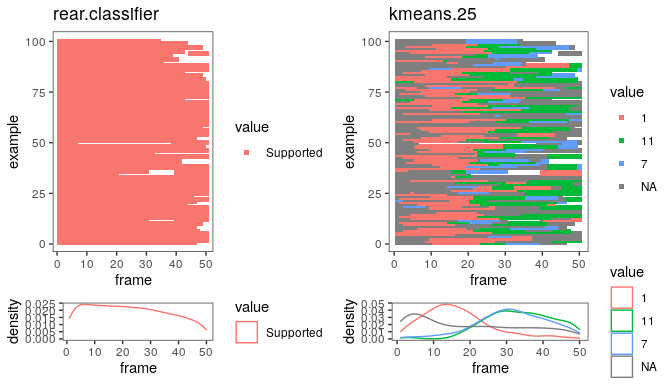

we see that from the 3 clusters that map most often to supported rears
cluster 1 describes rearing onset (first \~20 frames) most of the times,
and clusters 11 and 12 define rearing offset most of the times

### Calculating Transitionmatrices and ploting behavior flow

Next, we calculate add trainsitionsmatrix for each label class. The
transitionmatrix will contain information about how often a given
cluster/behavior flows into a different cluster/behavior.

``` r
US <- AddTransitionMatrixData(US)
```

the transitionmatrices will be saved in the individual files. to access
the one of the first file for the kmeans.25 label group we can use:

``` r
US$files[[1]]$transmatrix$kmeans.25
```

    ##     7 16 10 20  8 18 24 4 21 6 13  1 12 11 22 17 15 2  5 14 9  3 25 23 19
    ## 7   0  4  6  3 10  6  0 6  0 0  2  0  0  0  5  0  0 0  2  7 0  0  1  0  0
    ## 16  2  0  3  0  0  1  4 8  0 0  0  0  0  0  0  0  2 0  0  6 0  0  4  0  0
    ## 10  2  1  0 12  2  4  3 6  0 0  2  9  0  0  1  0  2 1  1  0 0  0  2  0  0
    ## 20  4  0  4  0  2  0 14 0  0 0  1 19  0  2  0  0  0 0 10  0 0  0  0  0  0
    ## 8   0  0  0  1  0  6  0 1  0 9  0  0  0  0  0  0  0 0  2  3 0  0  0  0  0
    ## 18  5  0  4  3  3  0  1 2  0 0  0  5  0  5  1  0  1 0  7  0 0  0  0  0  0
    ## 24  1 14  2  6  0  0  0 1  0 0  5  0  1  1  3  0  8 0  0  0 0  0  0  0  0
    ## 4   1  7  4  0  2  1  0 0  5 5  6  0  0  0  1  0  0 0  0  4 0  0  2  0  0
    ## 21  0  0  0  0  0  0  0 3  0 9  0  0  0  0  0  0  0 1  0  1 0  1  8  0  0
    ## 6   0  0  1  4  0  0  2 3  0 0 11  6  0  0  4  0  0 1  0  0 0  0  1  0  0
    ## 13  0  0  5  7  0  0  6 1  0 3  0  5  0  0  0  0  0 0  5  0 0  0  0  0  0
    ## 1   0  0  0  3  0  3  1 0  0 0  0  0 15 27  0  3  3 0  1  0 1  0  0  0  0
    ## 12  0  0  0  1  0  0  0 0  0 0  0  0  0 19  0  0  1 0  1  0 0  0  0  0  0
    ## 11 22  0  1  8  0  4  7 0  0 0  0  3  2  0  1  1  2 0  9  0 0  0  0  0  0
    ## 22  1  0  1  1  0  2  1 1  0 3  1  3  0  0  0  2  0 0  0  0 0  0  0  0  0
    ## 17  0  0  0  0  0  0  2 0  0 0  0  2  1  1  0  0  0 0  0  0 0  0  0  0  0
    ## 15  5  2  4  1  0  0  0 0  0 0  0  2  2  3  0  0  0 1  3  3 0  0  2  0  0
    ## 2   1  0  0  0  0  3  0 0  0 0  0  0  0  0  0  0  0 0  0  0 0  0  0  0  0
    ## 5   7  0  6  2  2  6  0 2  0 0  0  3  1  1  0  0  7 0  0  5 0  0  2  0  0
    ## 14  0  1  1  0  1  1  0 1  7 0  0  0  0  0  0  0  2 0  0  0 0 12  4  2  0
    ## 9   0  0  0  0  0  0  0 0  0 0  0  0  0  1  0  0  0 0  0  0 0  0  0  0  0
    ## 3   0  0  0  0  0  0  0 0 11 0  0  0  0  0  0  0  0 0  0  1 0  0  2  1  0
    ## 25  0  1  6  4  0  0  1 3  0 5  4  0  0  0  0  0  0 0  3  2 0  0  0  0  0
    ## 23  0  0  0  0  0  0  0 0  0 0  0  0  0  0  0  0  0 0  0  0 0  2  1  0  0
    ## 19  0  0  0  0  0  0  0 0  0 0  0  0  0  0  0  0  0 0  0  0 0  0  0  0  0

rows will tell you from where it flows, columns to where it flows. i.e
here there were 22 transitions from cluster 11 to cluster 7

Transitionmatrix data is crucial for many downstream applications. for
example if we want to plot behavior flow across all samples this data is
required

``` r
PlotBehaviorFlow(US, lab = "kmeans.25")
```

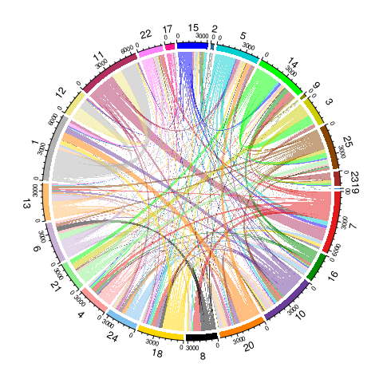

### Mapping different label groups to each other

We might want to know how two different label groups relate to each other. For example, we might want to know which of our kmeans clusters describe rearing behaviors as determined by a classifier. To do this, we first need to calculate the confusion matrix between each label group across all files.

``` r
US <- AddConfusionMatrix(US)
```

Once this operation is performed we will find confusion matrix data in
our USData

``` r
US$ConfusionMatrix$`kmeans.25-rear.classifier`
```

    ##     to
    ## from  None Supported Unsupported
    ##   1   9308     42766        3450
    ##   10 40200      4703        5456
    ##   11  9191     31507        3361
    ##   12 12561     15129        4357
    ##   13 38634      2975         384
    ##   14 46643        19        6181
    ##   15 28312       840        9137
    ##   16 26447       268        2029
    ##   17  8531      1563         257
    ##   18 26094     11976       11826
    ##   19   254         0           0
    ##   2   2278       404           9
    ##   20 43068      6612        2336
    ##   21 24375        10         417
    ##   22 20278      5024         959
    ##   23 18680         0        8393
    ##   24 27790      5320        1893
    ##   25 43661        10        2987
    ##   3  49072        11        1552
    ##   4  28975       871        3809
    ##   5  40632      6245        2994
    ##   6  33225      1473         538
    ##   7  18092     10761        3146
    ##   8  34814       909        1823
    ##   9   3489       153         864

we see for example that cluster 1 maps to supported rears in 42766
frames across the whole dataset. A normalized version of the confusion
matrix is also created which gives this information in percents (i.e 77%
here)

``` r
US$ConfusionMatrix_norm$`kmeans.25-rear.classifier`
```

    ##     to
    ## from      None    Supported Unsupported
    ##   1  0.1676392 0.7702254881 0.062135293
    ##   10 0.7982684 0.0933894637 0.108342104
    ##   11 0.2086066 0.7151092853 0.076284074
    ##   12 0.3919556 0.4720878709 0.135956564
    ##   13 0.9200105 0.0708451409 0.009144381
    ##   14 0.8826713 0.0003595557 0.116969135
    ##   15 0.7394291 0.0219384157 0.238632505
    ##   16 0.9200877 0.0093236849 0.070588645
    ##   17 0.8241716 0.1509999034 0.024828519
    ##   18 0.5229678 0.2400192400 0.237012987
    ##   19 1.0000000 0.0000000000 0.000000000
    ##   2  0.8465255 0.1501300632 0.003344482
    ##   20 0.8279760 0.1271147339 0.044909259
    ##   21 0.9827836 0.0004031933 0.016813160
    ##   22 0.7721717 0.1913103081 0.036518031
    ##   23 0.6899863 0.0000000000 0.310013667
    ##   24 0.7939319 0.1519869725 0.054081079
    ##   25 0.9357666 0.0002143255 0.064019032
    ##   3  0.9691320 0.0002172410 0.030650736
    ##   4  0.8609419 0.0258802555 0.113177834
    ##   5  0.8147420 0.1252230755 0.060034890
    ##   6  0.9429277 0.0418038370 0.015268475
    ##   7  0.5653927 0.3362917591 0.098315572
    ##   8  0.9272359 0.0242103020 0.048553774
    ##   9  0.7743009 0.0339547270 0.191744341

We can further plot this by using:

``` r
PlotConfusionMatrix(US$ConfusionMatrix_norm$`kmeans.25-rear.classifier`,pointsize = 5)
```

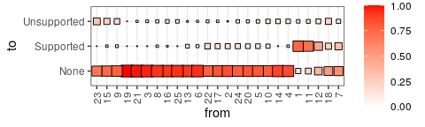

Grouped analyses
----------------

### Adding metadata

In many cases, we might want to statistically assess if there is a difference between a control and test group. To do this, we first need to supply the USData object with metadata describing the experimental design. We can load the metadata from a .csv file, such as the one found in `ExampleData/Example_metadata.csv`

``` r
head(US$file_names)
```

    ## [1] "1_01_A_190507114629DeepCut_resnet50_Blockcourse1May9shuffle1_1030000.csv" 
    ## [2] "10_01_A_190507141248DeepCut_resnet50_Blockcourse1May9shuffle1_1030000.csv"
    ## [3] "11_01_A_190507142850DeepCut_resnet50_Blockcourse1May9shuffle1_1030000.csv"
    ## [4] "12_01_A_190507144429DeepCut_resnet50_Blockcourse1May9shuffle1_1030000.csv"
    ## [5] "13_01_A_190507145949DeepCut_resnet50_Blockcourse1May9shuffle1_1030000.csv"
    ## [6] "14_01_A_190507151530DeepCut_resnet50_Blockcourse1May9shuffle1_1030000.csv"

``` r
metadata <- read.table("ExampleData/Example_metadata.csv", sep = ";", header = T)
head(metadata)
```

    ##      ID Condition
    ## 1 OFT_1       CSI
    ## 2 OFT_2       CSI
    ## 3 OFT_3       CSI
    ## 4 OFT_4       CSI
    ## 5 OFT_5       CSI
    ## 6 OFT_6       CSI
    ##                                                                     DLCFile
    ## 1  1_01_A_190507114629DeepCut_resnet50_Blockcourse1May9shuffle1_1030000.csv
    ## 2 19_02_A_190507123740DeepCut_resnet50_Blockcourse1May9shuffle1_1030000.csv
    ## 3  7_01_A_190507132652DeepCut_resnet50_Blockcourse1May9shuffle1_1030000.csv
    ## 4 24_02_A_190507141305DeepCut_resnet50_Blockcourse1May9shuffle1_1030000.csv
    ## 5 13_01_A_190507145949DeepCut_resnet50_Blockcourse1May9shuffle1_1030000.csv
    ## 6 17_02_A_190507120259DeepCut_resnet50_Blockcourse1May9shuffle1_1030000.csv
    ##   Session Treatment Dosage TimePoint Experiment   Animal
    ## 1 PostCSI   Control     NA        NA     CSI_SA CSI_SA_1
    ## 2 PostCSI   Control     NA        NA     CSI_SA CSI_SA_2
    ## 3 PostCSI   Control     NA        NA     CSI_SA CSI_SA_3
    ## 4 PostCSI   Control     NA        NA     CSI_SA CSI_SA_4
    ## 5 PostCSI   Control     NA        NA     CSI_SA CSI_SA_5
    ## 6 PostCSI   Control     NA        NA     CSI_SA CSI_SA_6

**Note:** in order to add this metadata to the USdata we need to ensure
2 points  
**1)** the metadata needs to contain one entry for each file in US  
**2)** the row names of the `metadata` need to correspond to the
file_names of `US`

We can see that the metadtata contains the filenames under the name
`"DLCFile"`. We change the rownames of metadata and ensure that we have
an entry for each file in `US`

``` r
rownames(metadata) <- metadata$DLCFile
US$file_names %in% rownames(metadata)
```

    ##  [1] TRUE TRUE TRUE TRUE TRUE TRUE TRUE TRUE TRUE TRUE TRUE TRUE TRUE TRUE TRUE
    ## [16] TRUE TRUE TRUE TRUE TRUE TRUE TRUE TRUE TRUE TRUE TRUE TRUE TRUE TRUE TRUE
    ## [31] TRUE TRUE TRUE TRUE TRUE TRUE TRUE TRUE TRUE TRUE TRUE TRUE TRUE TRUE TRUE
    ## [46] TRUE TRUE TRUE TRUE TRUE TRUE TRUE TRUE TRUE TRUE TRUE TRUE TRUE TRUE

Now we can add the metadata to the USdata using:

``` r
US <- AddMetaData(US,metadata)
str(US$meta)
```

    ## 'data.frame':    59 obs. of  10 variables:
    ##  $ filename  : chr  "1_01_A_190507114629DeepCut_resnet50_Blockcourse1May9shuffle1_1030000.csv" "10_01_A_190507141248DeepCut_resnet50_Blockcourse1May9shuffle1_1030000.csv" "11_01_A_190507142850DeepCut_resnet50_Blockcourse1May9shuffle1_1030000.csv" "12_01_A_190507144429DeepCut_resnet50_Blockcourse1May9shuffle1_1030000.csv" ...
    ##  $ ID        : chr  "OFT_1" "OFT_34" "OFT_9" "OFT_44" ...
    ##  $ Condition : chr  "CSI" "Control" "CSI" "Control" ...
    ##  $ DLCFile   : chr  "1_01_A_190507114629DeepCut_resnet50_Blockcourse1May9shuffle1_1030000.csv" "10_01_A_190507141248DeepCut_resnet50_Blockcourse1May9shuffle1_1030000.csv" "11_01_A_190507142850DeepCut_resnet50_Blockcourse1May9shuffle1_1030000.csv" "12_01_A_190507144429DeepCut_resnet50_Blockcourse1May9shuffle1_1030000.csv" ...
    ##  $ Session   : chr  "PostCSI" "PostCSI" "PostCSI" "PostCSI" ...
    ##  $ Treatment : chr  "Control" "Control" "Control" "Control" ...
    ##  $ Dosage    : logi  NA NA NA NA NA NA ...
    ##  $ TimePoint : logi  NA NA NA NA NA NA ...
    ##  $ Experiment: chr  "CSI_SA" "CSI_SA" "CSI_SA" "CSI_SA" ...
    ##  $ Animal    : chr  "CSI_SA_1" "CSI_SA_34" "CSI_SA_9" "CSI_SA_44" ...

as we can see the metadata has now been added to the USdata and can be
easily accessed. If we want to know the Condition of the samples we can
simply use

``` r
US$meta$Condition
```

    ##  [1] "CSI"     "Control" "CSI"     "Control" "CSI"     "Control" "CSI"    
    ##  [8] "Control" "CSI"     "Control" "CSI"     "Control" "Control" "CSI"    
    ## [15] "CSI"     "Control" "CSI"     "Control" "CSI"     "Control" "CSI"    
    ## [22] "Control" "CSI"     "CSI"     "Control" "CSI"     "Control" "CSI"    
    ## [29] "Control" "CSI"     "Control" "CSI"     "Control" "Control" "CSI"    
    ## [36] "Control" "CSI"     "Control" "CSI"     "Control" "CSI"     "Control"
    ## [43] "CSI"     "Control" "CSI"     "CSI"     "Control" "CSI"     "Control"
    ## [50] "CSI"     "Control" "CSI"     "Control" "CSI"     "Control" "Control"
    ## [57] "CSI"     "Control" "CSI"

Next, lets investigate how behavior flows differently between CSI and
Control animals for this we can now use:

``` r
PlotBehaviorFlow_Delta(US,grouping = (US$meta$Condition == "CSI"), lab = "kmeans.25")
```

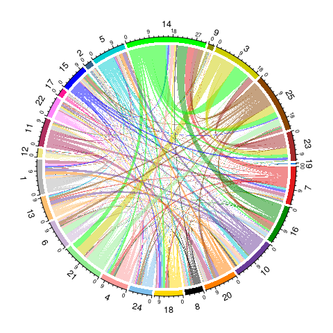

This plot will show all transitions that are in average different
between CSI and Control animals. If we more specifically want to see
which transitions are upregulated or downregulated in CSI we instead use

``` r
PlotBehaviorFlow_Delta(US,grouping = (US$meta$Condition == "CSI"), lab = "kmeans.25", method = "up")
```

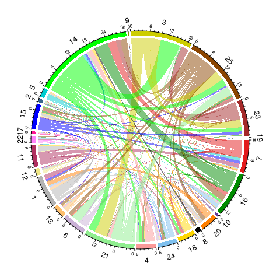

``` r
PlotBehaviorFlow_Delta(US,grouping = (US$meta$Condition == "CSI"), lab = "kmeans.25", method = "down")
```

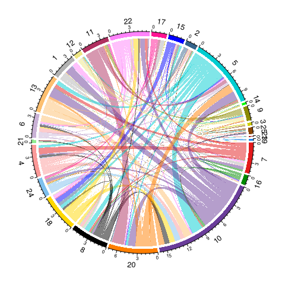

### statiatical two group comparisons and Behavior Flow Analysis

The previous plots showed average metrics that didn’t take variability into consideration, so we have to be careful not to over-interpret the results without running proper statistical analyses. Fortunately, there’s a function that can run all two-group comparisons with appropriate multi-testing corrections for cluster and transition occurences, as well as a Behavior Flow Analysis (BFA) which hollistically tests for a group difference across all transitions using a single command:

``` r
US <- TwoGroupAnalysis(US, group = US$meta$Condition)
```

    ## Loading required package: prcma

    ## Warning in library(package, lib.loc = lib.loc, character.only = TRUE,
    ## logical.return = TRUE, : there is no package called 'prcma'

    ## [1] "no label specified, performing analysis for all"

Results for this analysis were automatically added to the US object and
can be accessed under:

``` r
str(US$Results$`CSI-vs-Control`)
```

    ## List of 2
    ##  $ Statistics     :List of 3
    ##   ..$ raw            :'data.frame':  41 obs. of  6 variables:
    ##   .. ..$ name   : chr [1:41] "bodycentre.center.distance.moving" "bodycentre.center.transitions" "bodycentre.center.raw.distance" "bodycentre.center.time.moving" ...
    ##   .. ..$ p      : num [1:41] 5.39e-07 5.54e-07 1.44e-06 1.66e-06 2.13e-05 ...
    ##   .. ..$ CSI    : num [1:41] 702.73 73.4 809.28 47.58 5.67 ...
    ##   .. ..$ Control: num [1:41] 441.58 50 530.14 30.39 5.04 ...
    ##   .. ..$ FC     : num [1:41] 1.59 1.47 1.53 1.57 1.13 ...
    ##   .. ..$ FDR    : num [1:41] 4.88e-05 4.88e-05 7.32e-05 7.32e-05 7.08e-04 ...
    ##   ..$ rear.classifier:'data.frame':  6 obs. of  6 variables:
    ##   .. ..$ name   : chr [1:6] "Unsupported.count" "Supported.count" "Supported.nframes" "Unsupported.nframes" ...
    ##   .. ..$ p      : num [1:6] 0.505 0.603 0.612 0.695 0.757 ...
    ##   .. ..$ CSI    : num [1:6] 44.1 56.6 2501.6 1353.2 93 ...
    ##   .. ..$ Control: num [1:6] 41.2 55 2569 1295.2 91.4 ...
    ##   .. ..$ FC     : num [1:6] 1.069 1.028 0.974 1.045 1.017 ...
    ##   .. ..$ FDR    : num [1:6] 1 1 1 1 1 1
    ##   ..$ kmeans.25      :'data.frame':  50 obs. of  6 variables:
    ##   .. ..$ name   : chr [1:50] "X14.count" "X21.count" "X21.nframes" "X3.count" ...
    ##   .. ..$ p      : num [1:50] 1.30e-06 1.87e-06 2.08e-05 3.09e-05 8.46e-05 ...
    ##   .. ..$ CSI    : num [1:50] 51.6 29.3 469.3 29.5 43.6 ...
    ##   .. ..$ Control: num [1:50] 36.5 21.7 369.8 20.1 33.3 ...
    ##   .. ..$ FC     : num [1:50] 1.41 1.35 1.27 1.47 1.31 ...
    ##   .. ..$ FDR    : num [1:50] 0.000211 0.000211 0.00156 0.001739 0.003806 ...
    ##  $ TransitionStats:List of 2
    ##   ..$ rear.classifier:List of 6
    ##   .. ..$ distance   : num 5.92
    ##   .. ..$ bootstraps : num [1:1000] 27.28 2.55 7.35 4.12 12.07 ...
    ##   .. ..$ percentile : num 17.5
    ##   .. ..$ sigma      : num -0.948
    ##   .. ..$ p.value    : num 0.828
    ##   .. ..$ transitions:'data.frame':   9 obs. of  7 variables:
    ##   .. .. ..$ from   : chr [1:9] "Supported" "Unsupported" "None" "Unsupported" ...
    ##   .. .. ..$ to     : chr [1:9] "Unsupported" "Supported" "Unsupported" "None" ...
    ##   .. .. ..$ p.value: num [1:9] 0.0448 0.0599 0.737 0.7501 0.9249 ...
    ##   .. .. ..$ CSI    : num [1:9] 3.47 4.17 40.33 39.33 52.67 ...
    ##   .. .. ..$ Control: num [1:9] 2.14 2.62 39 38.07 52.41 ...
    ##   .. .. ..$ FC     : num [1:9] 1.62 1.59 1.03 1.03 1 ...
    ##   .. .. ..$ FDR    : num [1:9] 0.44 0.44 1 1 1 ...
    ##   ..$ kmeans.25      :List of 6
    ##   .. ..$ distance   : num 143
    ##   .. ..$ bootstraps : num [1:1000] 96.1 94.5 108 93.4 110 ...
    ##   .. ..$ percentile : num 99.9
    ##   .. ..$ sigma      : num 6.42
    ##   .. ..$ p.value    : num 6.71e-11
    ##   .. ..$ transitions:'data.frame':   625 obs. of  7 variables:
    ##   .. .. ..$ from   : chr [1:625] "16" "14" "3" "3" ...
    ##   .. .. ..$ to     : chr [1:625] "14" "3" "21" "25" ...
    ##   .. .. ..$ p.value: num [1:625] 6.12e-06 1.55e-05 1.70e-04 3.80e-04 4.32e-04 ...
    ##   .. .. ..$ CSI    : num [1:625] 10.47 19.73 13.4 8.03 5.33 ...
    ##   .. .. ..$ Control: num [1:625] 6.21 13.34 9.34 4.86 3.21 ...
    ##   .. .. ..$ FC     : num [1:625] 1.69 1.48 1.43 1.65 1.66 ...
    ##   .. .. ..$ FDR    : num [1:625] 0.0158 0.02 0.1457 0.2142 0.2142 ...

lets have a look at kmeans clusters and see if any are different between
CSI and Control animals

``` r
head(US$Results$`CSI-vs-Control`$Statistics$kmeans.25,10)
```

    ##           name            p        CSI   Control        FC         FDR
    ## 40   X14.count 1.301842e-06   51.56667  36.48276 1.4134531 0.000210856
    ## 18   X21.count 1.874607e-06   29.33333  21.65517 1.3545648 0.000210856
    ## 17 X21.nframes 2.079875e-05  469.26667 369.79310 1.2689979 0.001559631
    ## 44    X3.count 3.091483e-05   29.50000  20.10345 1.4674099 0.001738652
    ## 46   X25.count 8.459415e-05   43.56667  33.31034 1.3079020 0.003806065
    ## 43  X3.nframes 1.025069e-03  980.53333 731.68966 1.3400946 0.038433304
    ## 39 X14.nframes 1.292141e-03 1009.13333 778.24138 1.2966842 0.041525772
    ## 6    X10.count 1.776228e-03   44.40000  52.13793 0.8515873 0.044651687
    ## 37  X5.nframes 1.786383e-03  722.93333 971.82759 0.7438905 0.044651687
    ## 4    X16.count 2.340485e-03   27.96667  21.75862 1.2853143 0.052651611

Indeed we see that a number of clusters are significant between CSI and
Control even after FDR correction

lets have a look if any transitions between clusters are different
between CSI and Control animals

``` r
head(US$Results$`CSI-vs-Control`$TransitionStats$kmeans.25$transitions,10)
```

    ##     from to      p.value       CSI   Control       FC        FDR
    ## 45    16 14 6.123591e-06 10.466667  6.206897 1.686296 0.01576857
    ## 497   14  3 1.549739e-05 19.733333 13.344828 1.478725 0.01995330
    ## 534    3 21 1.697303e-04 13.400000  9.344828 1.433948 0.14568817
    ## 548    3 25 3.802951e-04  8.033333  4.862069 1.652246 0.21421873
    ## 570   25 14 4.315642e-04  5.333333  3.206897 1.663082 0.21421873
    ## 20     7 14 5.105470e-04  8.666667  5.896552 1.469786 0.21421873
    ## 223   21 25 5.823303e-04  9.800000  7.068966 1.386341 0.21421873
    ## 484   14 21 2.050648e-03  9.166667  6.793103 1.349408 0.66006572
    ## 554   25 20 2.451013e-03  2.933333  1.724138 1.701333 0.70127651
    ## 552   25 16 4.336459e-03  4.033333  2.103448 1.917486 1.00000000

Indeed we see that a number of transitions are significant between CSI
and Control even after FDR correction

And finally the package includes a bootstrapping method which we termed Behavior Flow Analysis (BFA) that
statistically assesses if there is a group difference between CSI and
Control when considering the overall difference in behavior flow between
the two groups. Results can be visualized using:

``` r
PlotTransitionsStats(US, labels = "kmeans.25")
```

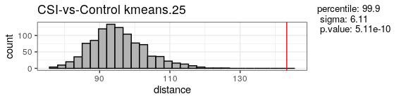

### Behavior Flow Fingerprinting

In this section, we introduce the concept of Behavior Flow Fingerprinting (BFF). This method looks at all transitions for each sample and tries to determine how close each sample is to other samples. We can further color by treatment variables, which can be categorical or continuous. The resulting 2D embedding is easier to understand and allows us to see how close groups are to each other and how many outliers are present in general.
To perform a BFF across all files based on transitions we can use:

``` r
Plot2DEmbedding(US, transitionmatrices = "kmeans.25", colorby = "Condition", color = c("grey","red"), plot.sem = T)
```

    ## [1] "including transitionmatrix: kmeans.25"

    ## ***UMAP wrapper function***

    ## running...

    ## done.

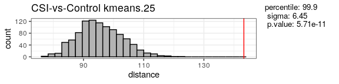

*Tip: Default the function will perform a UMAP embedding. To perform a
t-sne embedding instead we can use the function with the parameter:*
`method = "tsne"` *This will automatically perform a t-sne embedding for
which we can also change the perplexity manually (see below)*

2D embedding works better the more distinct samples we present. Keep in
mind that embedding with very low numbers will not yield good results,
and at some point the algorithms will refuse to work with low number
sizes. For tsne we can work with lower samples by specifying the
´perplex´ to be small:

``` r
US_small <- SplitUSData(US,include = US$file_names[1:10])
Plot2DEmbedding(US_small, transitionmatrices = "kmeans.25", colorby = "Condition", color = c("grey","red"), method = "tsne", perplex = 3)
```

    ## [1] "including transitionmatrix: kmeans.25"

    ## ***t-SNE wrapper function***

    ## running...

    ## done.

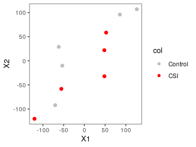

while this embedding will work with lower numbers as you may note that
the quality is getting much worse. It is highly recommended to use
sample sizes of \~ \> 20 if possible for a decent 2D embedding

### Behavior Flow Fingerprinting across multiple datasets

Often we might want to compare data across multiple datasets and see if
there are any phenotypes that are close to each other. We start by
loading a already prepared USdata object from a .rds file that contains
clustering data from 3 different datasets

``` r
US_multi <- readRDS("ExampleData/ExampleUS_Multidataset.rds")
```

lets get a bit of an overview over the datasets:

``` r
names(US_multi$meta)
```

    ## [1] "ID"         "Condition"  "Session"    "Dosage"     "TimePoint" 
    ## [6] "Experiment" "Animal"

``` r
table(US_multi$meta$Experiment)
```

    ## 
    ##  CSI_SA     FST Tun_Yoh 
    ##      59      30      20

``` r
table(paste(US_multi$meta$Experiment, US_multi$meta$Condition, sep = "-"))
```

    ## 
    ##   CSI_SA-Control       CSI_SA-CSI      FST-Control         FST-Swim 
    ##               29               30               15               15 
    ##  Tun_Yoh-Control Tun_Yoh-Yohimbin 
    ##                5               15

As we can see we have 3 different datasets, with 59, 30 and 20
replicates respectively. we see that all three datasets have control
groups, and different treatment groups (CSI = chronic social instabiliy,
Swim = forced swim stress, Yohimbin = Yohimbine injection
(pharmacolgically induced stress))

We start by embedding data of the control groups to see if there are any
inter-experiment differences using BFF

``` r
US2 <- SplitUSData(US_multi,select = US_multi$meta$Condition == "Control")
Plot2DEmbedding(US2,transitionmatrices = "kmeans.25",colorby = "Experiment", plot.sem = T)
```

    ## [1] "including transitionmatrix: kmeans.25"

    ## ***UMAP wrapper function***

    ## running...

    ## done.

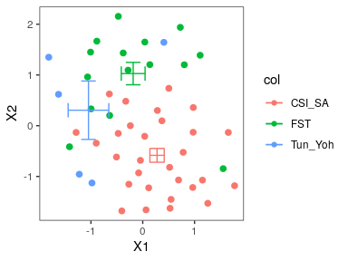

Indeed, we find that even Control groups between the different
experiments vary somewhat. in order to adress this problem we can use a
normalization approach to stabilize transitions of datasets to the
control groups. for this we have to specify for all the 3 subsets what
we set our control group to

``` r
#Stabilize the CSI_SA experiment samples to their control group
US_multi <- CalculateStabilizedTransitions(US_multi, group = "Condition",control = "Control",subset = US_multi$meta$Experiment == "CSI_SA")
```

    ## [1] "no label specified, performing transition matrix stabilization for all"

``` r
#Stabilize the FST experiment samples to their control group
US_multi <- CalculateStabilizedTransitions(US_multi, group = "Condition",control = "Control",subset = US_multi$meta$Experiment == "FST")
```

    ## [1] "no label specified, performing transition matrix stabilization for all"

``` r
#Stabilize the Tun_Yoh experiment samples to their control group
US_multi <- CalculateStabilizedTransitions(US_multi, group = "Condition",control = "Control",subset = US_multi$meta$Experiment == "Tun_Yoh")
```

    ## [1] "no label specified, performing transition matrix stabilization for all"

``` r
US2 <- SplitUSData(US_multi,select = US_multi$meta$Condition == "Control")
Plot2DEmbedding(US2,transitionmatrices_stabilized = "kmeans.25",colorby = "Experiment", plot.sem = T)
```

    ## [1] "including stabilized transitionmatrix: kmeans.25"

    ## ***UMAP wrapper function***

    ## running...

    ## done.

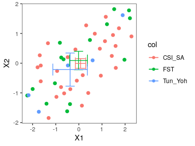

We can see that now the control groups have been fixed on each other. we
can now plot the full data with the Conditions colored

``` r
Plot2DEmbedding(US_multi,transitionmatrices_stabilized = "kmeans.25",colorby = "Condition", plot.sem = T, colors = c("grey","#3296df","#e8b220","#ec5230"))
```

    ## [1] "including stabilized transitionmatrix: kmeans.25"

    ## ***UMAP wrapper function***

    ## running...

    ## done.

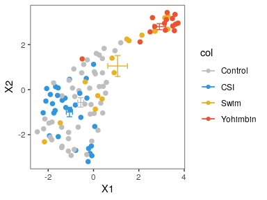
